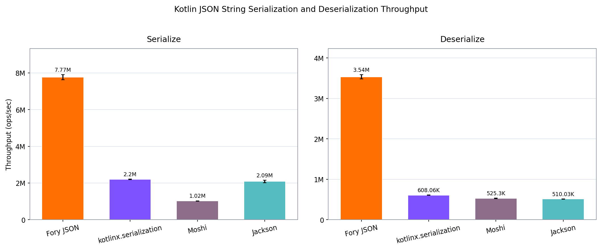
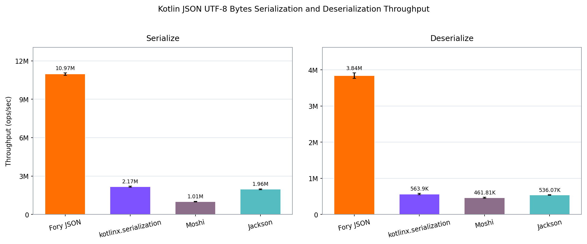

# Kotlin JSON Benchmarks

This project compares JSON serialization and deserialization of immutable Kotlin
`MediaContent`, `Users`, and `Clients` models with Fory JSON Kotlin, kotlinx.serialization,
Moshi code generation, and Jackson Kotlin.

Fory uses `org.apache.fory:fory-json-kotlin:1.7.1`, `ForyJsonKotlin.builder()`, and a retained
Kotlin type token for each model. The `MediaContent` model and correctness checks follow the
[Apache Fory Kotlin JSON harness](https://github.com/apache/fory/tree/main/benchmarks/kotlin).
The `Users` and `Clients` schemas come from
[java-json-benchmark](https://github.com/fabienrenaud/java-json-benchmark).

## Methodology

- All model properties are `val`, and the models have no public zero-argument constructor.
  Every model exercises required constructor arguments; `MediaContent` also exercises nullable
  members and compiler defaults.
- Every library emits null properties and default values. Setup verifies fixture reads through
  both representations, all eight own-output round trips, and JSON-tree equality across all
  eight outputs before timing, with typed timestamp equivalence for `Clients` as described below.
  The expected object is defined independently of each decoder.
- Fory's Kotlin type token, the kotlinx serializer, Moshi's generated adapter, and Jackson's typed
  reader/writer are retained outside the measured methods. Fory uses synchronous codec compilation
  so generation finishes before measurement. Runtime code generation remains enabled.
- String operations exclude UTF-8 conversion. Fory and Jackson use direct byte-array APIs;
  kotlinx.serialization uses `encodeToStream` / `decodeFromStream` with byte-array streams, and
  Moshi uses its Okio `Buffer` APIs. Buffer/stream allocation and byte-array extraction are included
  in the byte operations. None of those paths converts through an intermediate String.
- Each suite uses 16 methods: four libraries × two operations × two representations.
  The Users/Clients suite runs both payload parameters in one invocation (32 cases).
  A failed benchmark fails the run.

## MediaContent results

The Eishay fixture is checked at setup against SHA-256
`8faba2f57ab397f319aced5cf1e8411a76785557d4c7d1703ec9d540354310a1`.

Higher throughput is better. These results describe this model and configuration on one machine;
they are not a general performance guarantee. The previous report used mutable models, different
byte APIs, and another machine, so it is not a controlled Fory version-to-version comparison.

### String



### UTF-8 bytes



### Throughput

Scores are rounded to the nearest operation per second. Charts include the errors reported by JMH;
full precision, confidence intervals, and individual samples are retained in the raw JSON.

| Representation | Operation | Fory JSON Kotlin ops/s | kotlinx.serialization ops/s | Moshi ops/s | Jackson Kotlin ops/s |
| --- | --- | ---: | ---: | ---: | ---: |
| String | Serialize | 8,463,544 | 2,331,337 | 1,009,654 | 2,166,486 |
| String | Deserialize | 3,963,797 | 631,164 | 513,445 | 508,099 |
| UTF-8 bytes | Serialize | 12,314,484 | 1,059,643 | 1,015,884 | 1,954,090 |
| UTF-8 bytes | Deserialize | 4,449,742 | 729,606 | 701,187 | 531,665 |

### Fory JSON Kotlin throughput advantage

Each ratio is Fory JSON Kotlin throughput divided by the other library's throughput for the same
operation, computed from unrounded scores.

| Representation | Operation | vs. kotlinx.serialization | vs. Moshi | vs. Jackson Kotlin |
| --- | --- | ---: | ---: | ---: |
| String | Serialize | 3.63× | 8.38× | 3.91× |
| String | Deserialize | 6.28× | 7.72× | 7.80× |
| UTF-8 bytes | Serialize | 11.62× | 12.12× | 6.30× |
| UTF-8 bytes | Deserialize | 6.10× | 6.35× | 8.37× |

In this run, Fory JSON Kotlin delivered 3.63× to 12.12× the throughput of the compared libraries. It had the highest throughput in all four operations.

### Benchmark environment

- Date: 2026-09-07
- Measured source commit: `cbd1b2a4d018d7686a9f5662ef1ed2b3d76e9823`
- Machine: Apple M5, arm64, 10 CPU cores, 32 GiB memory
- OS: macOS 26.4 (25E246)
- JDK: Homebrew OpenJDK 25.0.3, OpenJDK 64-Bit Server VM
- Kotlin/compiler serialization plugin: 2.3.20
- KSP: 2.3.8; Moshi code generation: 1.15.2
- Gradle: 9.3.0; Gradle JMH plugin: 0.7.3; JMH: 1.37
- Configuration: 1 fork, 1 thread, 3 × 2-second warmup iterations, 5 × 2-second measurement iterations
- JVM option: `--add-opens=java.base/java.lang.invoke=ALL-UNNAMED`
- Libraries: Fory JSON Kotlin 1.7.1 (JSON and core also resolve to 1.7.1), kotlinx.serialization
  1.11.0, Moshi 1.15.2, Jackson Kotlin 2.22.1

The complete [JMH JSON](results/benchmark_results.json), [process output](results/jmh-output.txt),
and [environment record](results/environment.json) describe the same run.

## Users and Clients: 1000 KB

These larger payloads port the data structures from `java-json-benchmark` to Kotlin data classes
with required `val` properties. They add long documents, nested collections, and JDK value types
to the small `MediaContent` workload.

- **Users** contains strings, booleans, integers, doubles, tags, and nested friends. Its IDs,
  balances, and registration dates remain strings, matching the Java schema.
- **Clients** retains `Long`, `UUID`, `BigDecimal`, `LocalDate`, `OffsetDateTime`, an eye-color enum,
  `Array<String>` emails, `LongArray` phones, tags, and nested partners. The Kotlin port keeps the
  Java array field types; correctness checks compare array contents explicitly.

The [models and generators](https://github.com/fabienrenaud/java-json-benchmark/tree/97f33233e6a7276294bb574cda5312bf42b11f81/src/main/java/com/github/fabienrenaud/jjb)
are adapted under their [MIT license](LICENSES/java-json-benchmark-MIT.txt). The generator uses
`java.util.Random` with seed `20260811114233` and follows the upstream field lengths, value ranges,
and collection sizes. It appends complete records until Jackson's compact UTF-8 document reaches
at least 1,000,000 bytes (`1000 KB`, decimal units). This is a deterministic Kotlin corpus, not the
exact upstream Commons Lang random sequence or estimated-size generator, so these results are
not a controlled comparison with scores from the Java benchmark.

All four libraries read the same prebuilt JSON String or UTF-8 bytes and serialize the same object.
Fory uses its built-in JDK codecs. kotlinx.serialization and Moshi use explicit adapters for UUIDs
and dates as strings and `BigDecimal` as an unquoted JSON number without a `Double` conversion.
Jackson Kotlin registers `JavaTimeModule` 2.22.1, writes ISO-8601 dates, and retains time offsets.
The timestamp formatters may emit different trailing fractional zeros, such as `.98236797Z` and
`.982367970Z`; setup compares those fields as `OffsetDateTime` values. All other JSON fields are
compared exactly, including arbitrary-precision decimals. Fixture generation, verification,
adapter creation, and codec compilation finish outside the timed methods.

## Requirements

- JDK 25
- Python with matplotlib and NumPy to regenerate the figures

## Verify

```bash
./gradlew test jmhClasses
```

Tests cover fixture decoding, String/byte round trips, equivalent JSON trees, immutable constructor
requirements, Kotlin compiler defaults, and rejection of missing or null required properties.
Users/Clients tests additionally cover deterministic 1000 KB inputs, preserved Java field types,
array contents, exact high-precision decimals, 64-bit boundaries, Unicode, and time offsets.

Plot-selection checks prevent mixed payloads or duplicate cases from silently overwriting scores:

```bash
python3 -m unittest test_plot_json_benchmark.py
```

## Run

### MediaContent

```bash
./gradlew jmh --console=plain > results/jmh-output.txt 2>&1
```

Results are written to `build/reports/jmh/results.json`.

Regenerate the checked-in charts from the completed run:

```bash
cp build/reports/jmh/results.json results/benchmark_results.json
python3 -m pip install matplotlib numpy
python3 plot_json_benchmark.py
```

Update the report tables and environment record from that same run when publishing new results.

### Users and Clients

The explicit suite selection runs all 32 cases with `sizeKb=1000`:

```bash
mkdir -p results/users-clients
./gradlew jmh -PjmhInclude=UsersClientsBenchmark \
  -PjmhResultFile=build/reports/jmh/users-clients.json --console=plain \
  > results/users-clients/jmh-output.txt 2>&1
cp build/reports/jmh/users-clients.json results/users-clients/benchmark_results.json
python3 plot_json_benchmark.py --json-file results/users-clients/benchmark_results.json \
  --output-dir results/users-clients --payload users
python3 plot_json_benchmark.py --json-file results/users-clients/benchmark_results.json \
  --output-dir results/users-clients --payload clients
```

The plotting script requires an explicit payload for this suite and rejects duplicate or missing
cases. The MediaContent defaults and its existing reports are independent of this invocation.
